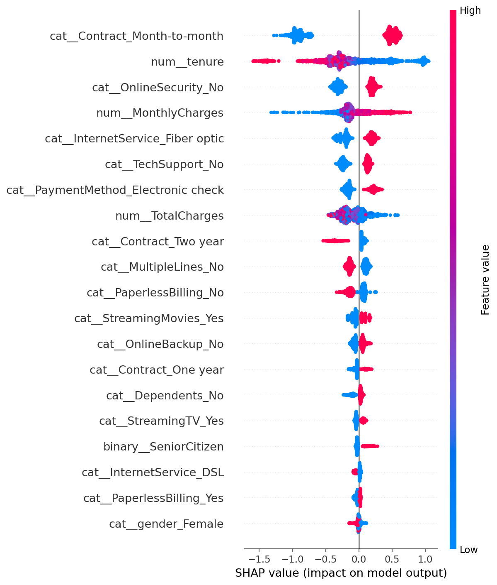

# Customer Churn Prediction

## Project Overview

A telecom company is losing customers without being able to identify who is at risk before they leave. This project builds a binary classification model to predict customer churn, enabling the retention team to prioritize interventions before revenue is lost.

- **Dataset:** Telco Customer Churn (Kaggle) — 7,043 rows, 21 columns
- **Target:** Churn (1 = churned, 0 = stayed)
- **Primary Metric:** Recall — missing a real churner costs more than a false alarm

---

## Data Preprocessing

1. Dropped `customerID` — non-predictive identifier
2. Converted `TotalCharges` from string to numeric — 11 hidden whitespace values found and imputed with 0 (customers with tenure = 0, not yet billed)
3. Encoded target variable `Churn` as binary (Yes → 1, No → 0)
4. Stratified train/test split (80/20) to preserve churn distribution
5. Built a leakage-safe `ColumnTransformer` — fitted on training data only
6. Applied `StandardScaler` to numerical features, `OneHotEncoder` to categorical features

---

## Modeling Results

| Model | Accuracy | Precision | Recall | F1-Score | ROC-AUC |
|---|---:|---:|---:|---:|---:|
| Logistic Regression | 0.738 | 0.504 | 0.783 | 0.614 | 0.842 |
| Random Forest | 0.779 | 0.607 | 0.471 | 0.530 | 0.819 |
| XGBoost | 0.747 | 0.515 | 0.797 | 0.625 | 0.847 |

**Selected model:** XGBoost — best recall, F1-score, and ROC-AUC. Random Forest was rejected due to low recall (0.471), which is unacceptable for a recall-focused business problem.

**Selected threshold:** 0.55 — reduces false positives from 281 to 246 compared to the default 0.50, while maintaining acceptable recall of 0.770. At this threshold the model catches 288 out of 374 churners.

---

## Explainability (SHAP)



- Customers on **month-to-month contracts** represent the strongest churn signal. Contract flexibility is a key driver of attrition.
- **Early-tenure customers** show the highest churn probability. The first months of the customer relationship are the most critical retention window.
- **High monthly charges** are positively correlated with churn risk, pointing to pricing sensitivity as a retention factor.

---

## Retention Recommendations

- **Onboarding incentives:** Offer discounted rates or service upgrades during the first three months to increase perceived value before the first cancellation window.
- **Contract migration:** Make quarterly or semi-annual contracts more attractive through competitive pricing or exclusive benefits, reducing reliance on month-to-month agreements.

---

## Project Structure
```
customer-churn-prediction/
├── data/
│   └── WA_Fn-UseC_-Telco-Customer-Churn.csv
├── notebooks/
│   ├── 01_EDA.ipynb
│   ├── 02_preprocessing.ipynb
│   ├── 03_modeling.ipynb
│   └── 04_explainability.ipynb
├── models/
│   ├── preprocessor.pkl
│   ├── xgboost_churn_model.pkl
│   ├── xgboost_threshold.pkl
│   ├── X_train_processed.npy
│   ├── X_test_processed.npy
│   ├── y_train.npy
│   └── y_test.npy
├── reports/
│   └── shap_summary_churn.png
├── src/
└── README.md
```